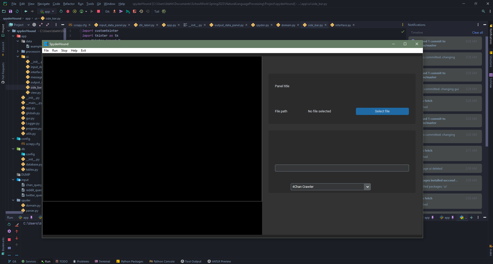
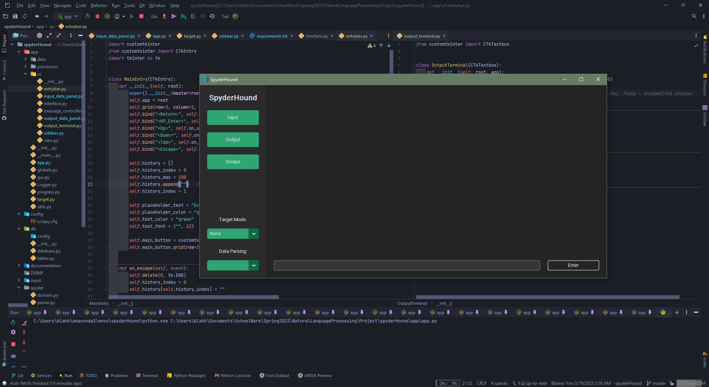
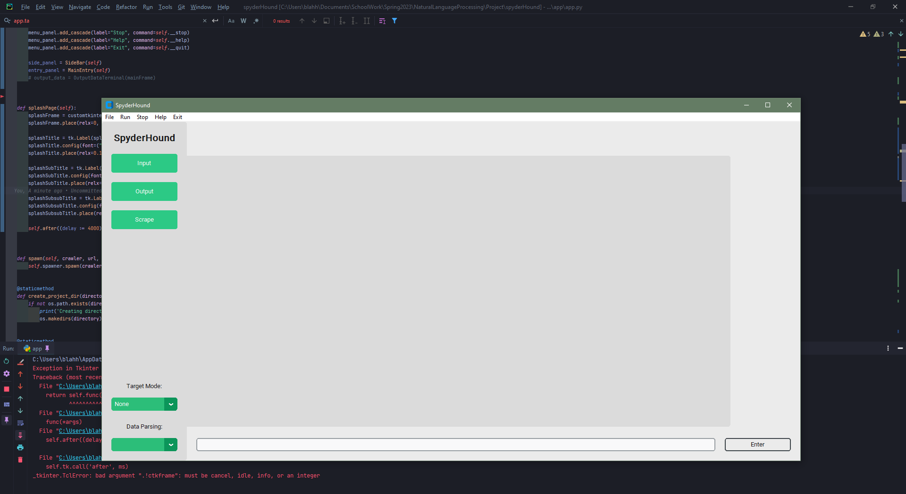
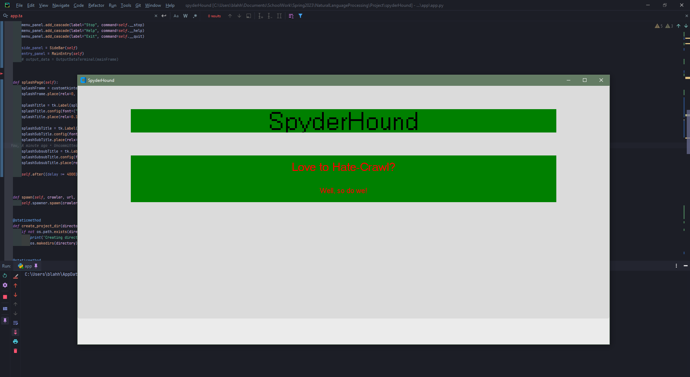
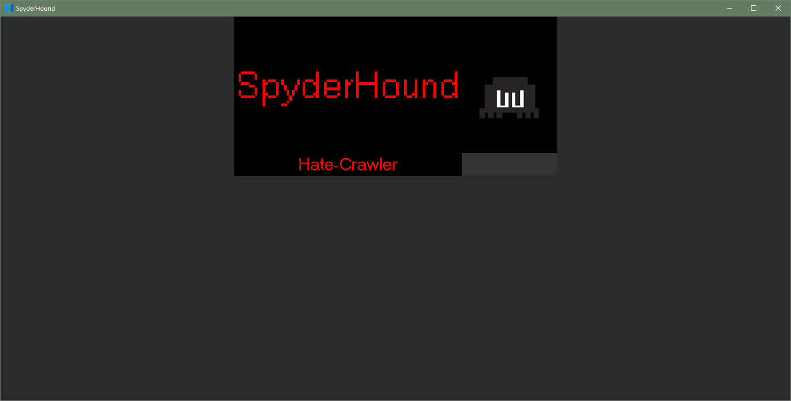
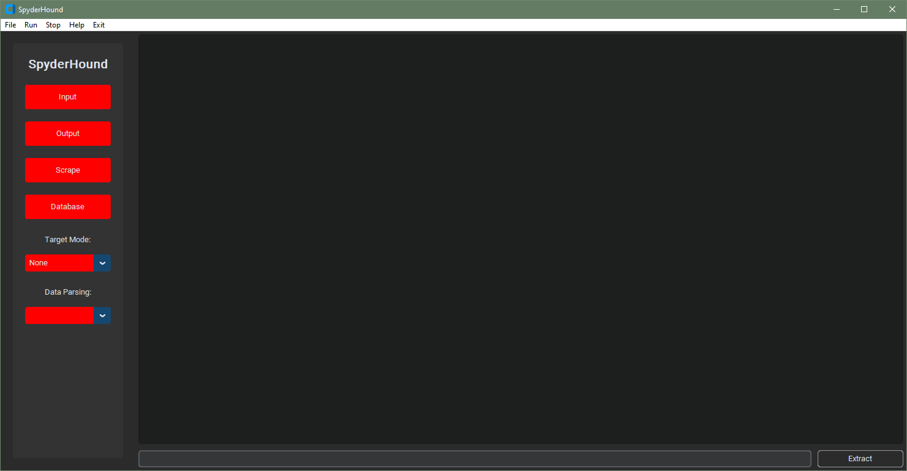
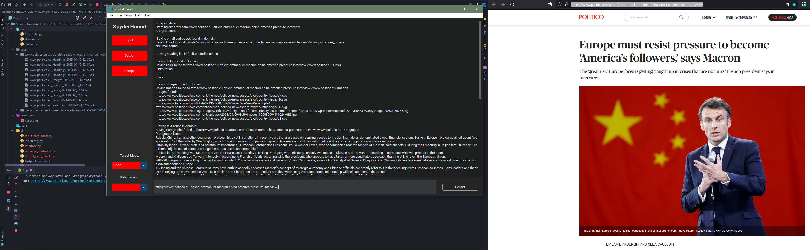

# SpyderHound

 <sup> https://github.com/MicMetz/SpyderHound </sup>

## Usage

### Run

<hr>

Start the app with `python run.py` or as a module: `python -m app`.

### Setup

<hr>

1. The GUI is built with tkinter, and customtkinter: `python pip install customtkinter && pip install tkinter`

2. To produce a standalone .exe file, also install pyinstaller, `pip install pyinstaller`; then run the build batch script, `tools/make_exe.bat` to produce the .exe file.

<hr>
<br>

* To interactively edit the GUI, you can use Qt designer: `designer.exe app/ui/app.ui`. All changes made to ui files have to be converted with the provided `tools/uicomp.bat` script. To obtain the
  designer, there are multiple options:
    * Install [customtkinter](https://github.com/TomSchimansky/CustomTkinter)
    * If you are using [conda](https://docs.conda.io/en/latest/) `conda install -c conda-forge tk`

## Development

- [ ] Layout
    - [X] Splash Screen
    - [X] Main Window
    - [X] Side Panel
    - [X] Input Terminal
    - [X] Output Terminal
    - [ ] Frames
        - [X] Main Frame
        - [ ] Data Frame
        - [ ] Database Frame
- [ ] Core
- [ ] Web Scraping
    - [X] Scraping
    - [ ] Correctly Stripping tokens
    - [ ] Parsing
    - [ ] Storing

<hr>

### Project Structure

The project is structured as follows:

```
.
├── core (Core Application Logic)
│   ├── Controller.py
│   ├── Target.py
│   ├── Domain.py
│   ├── Database.py
│   ├── resources (Resources)
│   │   ├── HateSpeech.py
│   ├── ui (User Interface Tkinter Design)
│   │   ├── OutputTerminal.py
│   │   ├── InputTerminal.py
│   │   ├── SidePanel.py
│   │   ├── MessageTerminal.py
├── data (Web Scraping Results)
│   ├── [Target Name]
│   │   ├── [Domain Name]
│   │   │   ├── [Date]
│   │   │   │   ├── [Time]
│   │   │   │   │   ├── [Data]
│   │   │   │   │   │   ├── [Data Type]
├── documentation (Documentation)
│   ├── images (Images)
├── tools (Not Yet Implemented)
├── App.py (Main Application Entry Point)

```

### GUI

The GUI is built with tkinter, and customtkinter.

A. The first draft of the GUI can be found in the [documentation](./public) folder. It is a first draft, and will be updated as the project progresses.


<br>

B. The second draft of the GUI can be found in the [documentation](./public) folder.You can see that the GUI has been updated to include how the application will be designed around the user conducting multiple scrapes simultaneously.


<br>

C.



<br>

Final GUI:





