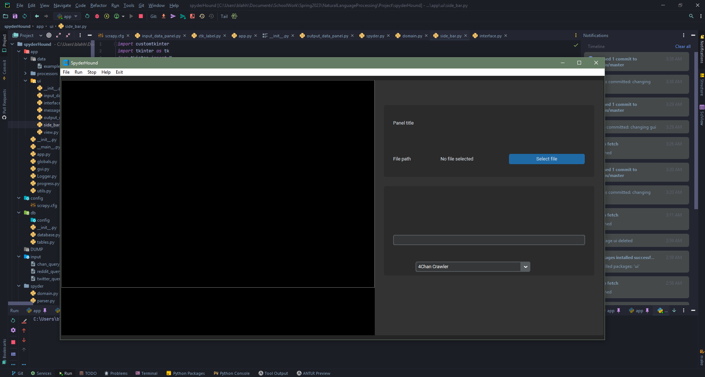

# SpyderHound

## Usage

### Run

Start the app with `python run.py` or as a module: `python -m app`.

### Setup

1. The GUI is built with tkinter, and customtkinter: `python pip install customtkinter && pip install tkinter`

2. To produce a standalone .exe file, also install pyinstaller, `pip install pyinstaller`; then run the build batch script, `tools/make_exe.bat` to produce the .exe file.

 

* To interactively edit the GUI, you can use Qt designer: `designer.exe app/ui/app.ui`. All changes made to ui files have to be converted with the provided `tools/uicomp.bat` script. To obtain the
  designer, there are multiple options:
    * Install [customtkinter](https://github.com/TomSchimansky/CustomTkinter)
    * If you are using [conda](https://docs.conda.io/en/latest/) `conda install -c conda-forge tk`

## Development

### GUI

The GUI is built with tkinter, and customtkinter.

A. The first draft of the GUI can be found in the [documentation](./documentation) folder. It is a first draft, and will be updated as the project progresses.

 

B. The second draft of the GUI can be found in the [documentation](./documentation) folder.
    You can see that the GUI has been updated to include how the application will be designed around the user conducting multiple scrapes simultaneously.

