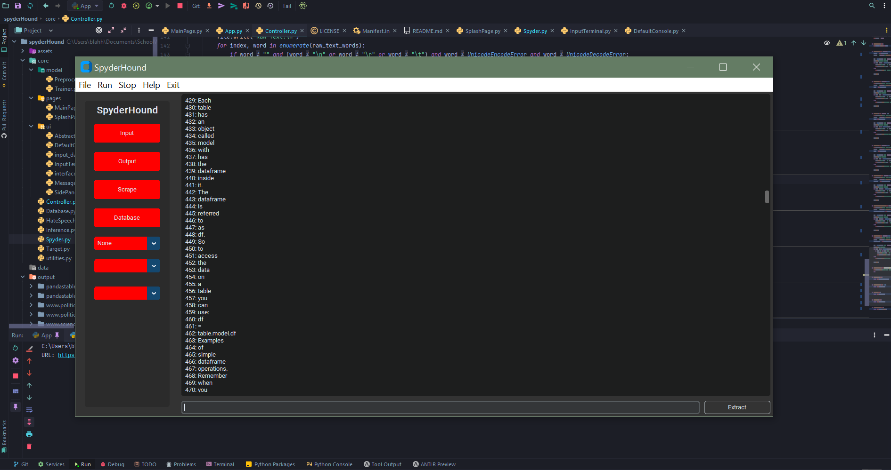

# SpyderHound

 <sup> https://github.com/MicMetz/SpyderHound </sup>

## Usage

### Run

<hr>

1. Start the app with `python App.py` .
   <br>
2. Place the target url in the input terminal, and press enter to start scraping a domain.
   <br>
3. The output terminal will display the progress of the scrape.
    1. Links
    2. Tokens (Words)
    3. Paragraphs
    4. Images

### Setup

<hr>

1. The GUI is built with tkinter, and customtkinter: `python pip install customtkinter && pip install tkinter`

2. To produce a standalone .exe file, also install pyinstaller, `pip install pyinstaller`; then run the build batch script, `tools/make_exe.bat` to produce the .exe file.

<hr>
<br>

* To interactively edit the GUI, you can use Qt designer: `designer.exe app/ui/app.ui`. All changes made to ui files have to be converted with the provided `tools/uicomp.bat` script. To obtain the
  designer, there are multiple options:
    * Install [customtkinter](https://github.com/TomSchimansky/CustomTkinter)
    * If you are using [conda](https://docs.conda.io/en/latest/) `conda install -c conda-forge tk`

## Project Structure

The project is structured as follows:

```
.
├── core (Core Application Logic)
│   ├── Controller.py
│   ├── Target.py
│   ├── Domain.py
│   ├── Database.py
├── resources (Resources)
│   ├── hate_speech (Hate Speech Data)
│   ├── neg_words (Negative Words)
│   ├── pos_words (Positive Words)
│   ├── stop_words (Stop Words)
│   ├── toxicity (Toxicity Data)
│   ├── ui (User Interface Tkinter Design)
│   │   ├── OutputTerminal.py
│   │   ├── InputTerminal.py
│   │   ├── SidePanel.py
│   │   ├── MessageTerminal.py
├── data (Web Scraping Results)
│   ├── [Target Name]
│   │   ├── [Domain Name]
│   │   │   ├── [Date]
│   │   │   │   ├── [Time]
│   │   │   │   │   ├── [Data]
│   │   │   │   │   │   ├── [Data Type]
├── documentation (Documentation)
│   ├── images (Images)
├── tools (Not Yet Implemented)
│   
├── App.py (Main Application Entry Point)
├── setup.py (Directory Linking)

```

## Development

- [ ] Layout
    - [X] Splash Screen
    - [X] Main Window
    - [X] Side Panel
    - [X] Input Terminal
    - [X] Output Terminal
    - [ ] Frames
        - [X] Splash Frame
        - [X] Main Frame
        - [ ] Data Frame
        - [ ] Database Frame
- [ ] Core
    - [ ] Web Scraping
        - [X] Scraping
            - [X] Improved Scraping with error handling
            - [X] Correctly Stripping tokens
        - [ ] Parsing
        - [ ] Storing
    - [ ] Database
        - [ ] Database Connection
        - [ ] Database Creation
        - [ ] Database Insertion
        - [ ] Database Querying
    - [ ] Data Analysis
        - [ ] Data Analysis
        - [ ] Data Visualisation
    - [ ] Data Visualisation
        - [ ] Data Visualisation

<hr>

### Updates and Progress

#### Better error handling for scraping

Improved token stripping



<hr>

### GUI

The GUI is built with tkinter, and customtkinter.

A. The first draft of the GUI can be found in the [documentation](./public) folder. It is a first draft, and will be updated as the project progresses.


<br>

B. The second draft of the GUI can be found in the [documentation](./public) folder.You can see that the GUI has been updated to include how the application will be designed around the user conducting multiple scrapes simultaneously.


<br>

C.


<br>

Final GUI:


